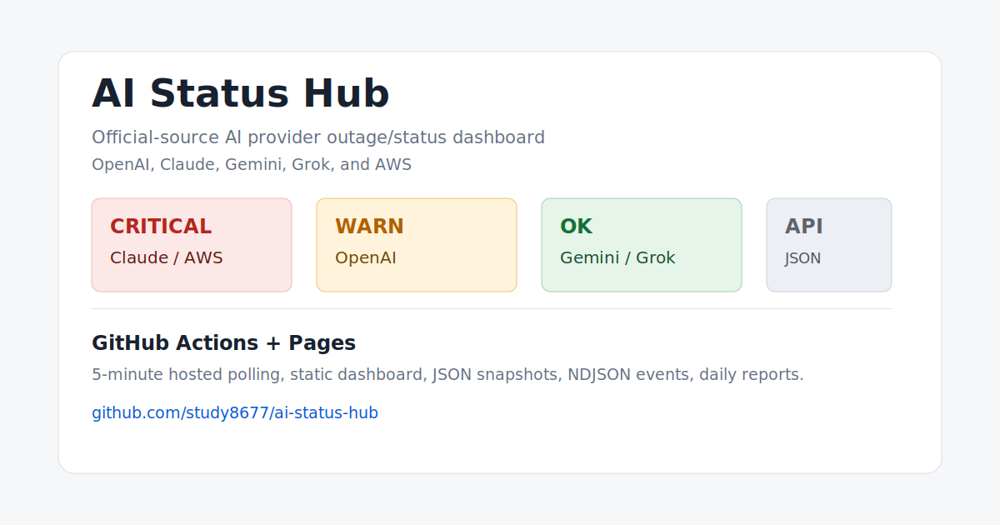

# AI 服务官方状态监控

[](https://github.com/study8677/aistatues/actions/workflows/monitor.yml)
[](https://study8677.github.io/aistatues/)
[](https://github.com/study8677/aistatues/stargazers)
[](./LICENSE)
[](https://www.python.org/)

一个官方状态源优先的 AI 服务稳定性看板。它把 OpenAI、Claude、Gemini、Grok、AWS 的官方公开状态数据聚合成 GitHub Pages 页面、JSON API、NDJSON 事件流和日报。

> English: an official-source-first AI status monitor for OpenAI, Claude, Gemini, Grok, and AWS, hosted entirely on GitHub Actions + Pages.

[在线看板](https://study8677.github.io/aistatues/) · [最新 JSON](https://study8677.github.io/aistatues/last_run.json) · [部署文档](./docs/SELF_HOST.md) · [输出 API](./docs/API.md) · [路线图](./docs/ROADMAP.md)

如果这个项目对你有用，可以点一个 Star，让更多人发现这个官方源监控方案。



## 为什么值得用

- **官方源优先**：不依赖第三方聚合站，不主动消耗模型 API quota。
- **免费托管**：GitHub Actions 定时采样，GitHub Pages 发布页面。
- **一眼判断问题**：服务按 `正常 / 预警 / 严重 / 未知` 排序，严重事件优先显示。
- **可机器读取**：同时发布 `last_run.json`、`events.ndjson`、日报 JSON/Markdown。
- **误报边界清晰**：抓取失败显示为 `未知`，不会直接算作 provider outage。
- **易于 Fork**：无第三方 Python 依赖，改 `services.json` 和 parser 就能扩展。

## Live Demo

| 页面 | 地址 |
|---|---|
| 中文状态看板 | https://study8677.github.io/aistatues/ |
| 最新快照 | https://study8677.github.io/aistatues/last_run.json |
| 事件流 | https://study8677.github.io/aistatues/output/events.ndjson |
| 日报 | https://github.com/study8677/aistatues/tree/gh-pages/reports |

快速查看当前状态：

```bash
curl -s https://study8677.github.io/aistatues/last_run.json \
  | jq -r '.services[] | [.service, .level, .overall_status] | @tsv'
```

## 更新频率

- 计划频率：每 5 分钟触发一次。
- 触发分钟：北京时间每小时 `00 / 05 / 10 / 15 / 20 / 25 / 30 / 35 / 40 / 45 / 50 / 55` 分。
- 实际更新：GitHub Actions 触发后还要完成采样、生成页面、推送 `gh-pages`，通常会晚几十秒到数分钟。
- 1 分钟级别监控：需要自托管 runner 或外部调度器，GitHub 托管 runner 不适合严格 1 分钟轮询。

## 官方数据源

| 服务 | 官方源 | 解析方式 | 说明 |
|---|---|---|---|
| OpenAI | https://status.openai.com/api/v2/summary.json | Statuspage JSON | 读取组件状态和 active incident。 |
| Claude | https://status.claude.com/api/v2/summary.json | Statuspage JSON | `indicator=none` 视为基础正常，但 active major incident 仍会拉红。 |
| Gemini | https://status.cloud.google.com/incidents.json | Google Cloud incident JSON | 只筛选 Gemini / Vertex Gemini 相关事件。 |
| Grok | https://status.x.ai/feed.xml | xAI RSS + 页面回退 | 页面被 Cloudflare 拦截时，以 RSS 作为主要机器可读源。 |
| AWS | https://health.aws.amazon.com/public/currentevents | AWS public health JSON | 全量 AWS public current events；响应为 UTF-16 JSON，事件时间来自 `event_log`。 |

## 自托管

Fork 后只需要 GitHub Actions + Pages：

1. Fork 仓库。
2. 在 fork 中启用 GitHub Actions。
3. 将 Pages 来源设为 `gh-pages` 分支。
4. 手动运行一次 `AI Services Status Monitor` workflow。
5. 打开你的 Pages URL。

更多细节见 [Self-hosting](./docs/SELF_HOST.md)。

## 本地运行

```bash
python3 -m unittest discover -s tests -v
python3 monitor.py run
python3 monitor.py report
python3 monitor.py loop --interval 60
```

## 输出结构

| 路径 | 用途 |
|---|---|
| `monitor.py` | 抓取、解析、评分、去抖、存储、页面渲染。 |
| `services.json` | 官方源服务配置。 |
| `tests/test_monitor.py` | 解析器和边界测试。 |
| `docs/API.md` | JSON/NDJSON/日报输出说明。 |
| `.github/workflows/monitor.yml` | GitHub Actions 托管运行。 |
| `gh-pages` 分支 | 发布页面和运行态数据。 |

## 状态规则

| 等级 | 含义 |
|---|---|
| `正常` / `ok` | 官方源显示 operational，且没有相关 active incident。 |
| `预警` / `warn` | 降级、部分故障或较低级别 active incident。 |
| `严重` / `critical` | major outage、service disruption、active major incident，或 AWS public currentevents 里的最高活动影响级别。 |
| `未知` / `unknown` | 官方源抓取或解析失败。这代表监控源健康问题，不直接算作服务故障。 |

告警去抖：

- 连续 2 次异常才触发。
- 连续 2 次恢复才消警。
- source failure 不直接制造 provider outage。

## 贡献

欢迎提交新的官方源、解析器、测试 fixture、页面可读性改进和输出格式。先看 [CONTRIBUTING.md](./CONTRIBUTING.md)。

适合贡献的方向：

- 添加更多 AI 服务的官方状态源。
- 改进 AWS AI 相关服务过滤。
- 增加 Slack/Feishu/Discord webhook 输出。
- 增加静态 SVG badge 输出。
- 增加中英切换和可访问性测试。

## 项目边界

这个项目只使用官方状态源，不主动探测模型 API，不发送测试 prompt，不依赖第三方聚合状态页。这样可以避免消耗 API quota，也能把信号限定在服务商正式发布的事件上。
